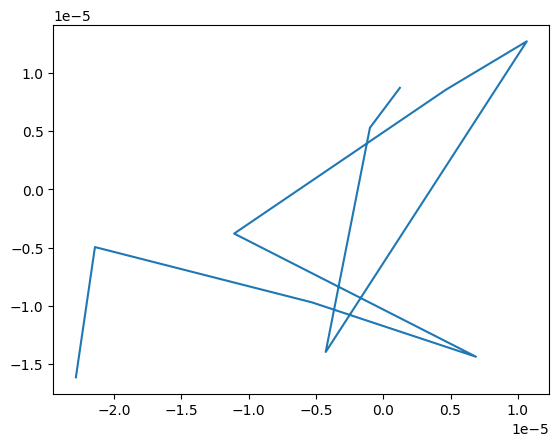

# Plano de información de MNIST con estimador MINE

## IDEA DEL PROYECTO

En 2017 Schwartz-Ziv y Tishby estudiaron el aprendizaje de las redes neuronales en el plano de la información. Sus resultados mostraron como el entrenamiento con SGD (Stochastic Gradient Descent) presentaba 2 fases diferenciadas, una primera fase de aprendizaje y otra de compresión.

Para sus experimentos utilizan una red feed-forward y un dataset artificial. Para cada capa intermedia de la red, capturan su salida vectorial, discretizan el output de las neuronas y finalmente calculan la información mutua entre la entrada X y la capa intermedia T, y entre T y la salida Y.

Durante el entrenamiento calcularon las cantidades I(X;T) e I(T;Y) para graficar una en función de la otra y estudiar el comportamiento de la capa en este plano.

El enfoque discretizado permite calcular las cantidades de interés, pero implica una pérdida en la información real. Sin embargo, el cálculo teórico de la información mutua continua es en general imposible con distribuciones de alta dimensión.

En 2021 se propuso el algoritmo MINE para la estimación de la información mutua entre variables aleatorias complejas de alta dimensión, utilizando distintas caracterizaciones de la divergencia KL. La representación Donsker-Varadhan plantea la divergencia KL como el supremo de una función sobre una clase de funciones.

Con esta caracterización, y tomando la clase de funciones las redes neuronales, obtenemos una función de pérdida y un problema de optimización sobre el cual es posible entrenar una red y aplicar técnicas de Deep Learning. El estimador MINE plantea la utilización de una red neuronal llamada "Red Estadística", entrenada bajo esta caracterización, para estimar la información mutua entre ambas variables.

Para este proyecto se plantea la utilización de redes convolucionales para el estudio de la información mutua entre el dataset MNIST y las capas de una pequeña red convolucional encargada de la clasificación de las imágenes. Se busca estudiar la primera capa convolucional de la red clasificadora. Para la aplicación del estimador MINE se propone la utilización de 2 redes estadísticas para la capa oculta, una para la estimación I(X;T) y otra para I(T;Y). Esto debido a la diferencia en dimensiones de las entradas y por la naturaleza de los datos.

## STACK TECNOLÓGICO

+ Modelo de datos: MNIST
+ Framework de Deep Learning: PyTorch
+ Estimador de MI: MINE
+ Arquitectura base: CNN

## IMPLEMENTACIÓN

```py
class CNNNet(nn.Module):
    def __init__(self):
        super(CNNNet, self).__init__()
        self.conv1 = nn.Conv2d(1, 32, kernel_size=3, padding=1)
        self.reluconv1 = nn.ReLU()
        self.maxpool1 = nn.MaxPool2d(kernel_size=2, stride=2)
        self.conv2 = nn.Conv2d(32, 64, kernel_size=3, padding=1)
        self.reluconv2 = nn.ReLU()
        self.maxpool2 = nn.MaxPool2d(kernel_size=2, stride=2)
        self.fc1 = nn.Linear(7*7*64, 16)
        self.relufc1 = nn.ReLU()
        self.fc2 = nn.Linear(16, 10)
        self.logsoftmax = nn.LogSoftmax(dim=1)

    def forward(self, x):
        x = self.reluconv1(self.conv1(x))
        x = self.maxpool1(x)
        x = self.reluconv2(self.conv2(x))
        x = self.maxpool2(x)
        x = x.view(-1, 7*7*64)
        x = self.relufc1(self.fc1(x))
        x = self.logsoftmax(self.fc2(x))
        return x
```

```py
class MINEIn(nn.Module):
    def __init__(self):
        super(MINEIn, self).__init__()
        self.reduce_t = nn.Conv2d(32, 1, kernel_size=1)
        self.conv1 = nn.Conv2d(2, 16, kernel_size=5, padding=2, stride=2)
        self.conv2 = nn.Conv2d(16, 32, kernel_size=5, padding=2, stride=2)
        self.conv3 = nn.Conv2d(32, 64, kernel_size=5, padding=2, stride=2)
        self.elu = nn.ELU()
        self.fc1 = nn.Linear(1024, 1024)
        self.fc2 = nn.Linear(1024, 1)

    def forward(self, x, t):
        t = self.reduce_t(t)
        h = torch.cat([x, t], dim = 1)
        h = self.elu(self.conv1(h))
        h = self.elu(self.conv2(h))
        h = self.elu(self.conv3(h))
        h = h.view(-1, 1024)
        h = self.fc1(h)
        h = self.fc2(h)
        return h
```

```py
class MINEOut(nn.Module):
    def __init__(self):
        super(MINEOut, self).__init__()
        self.reduce_t = nn.Conv2d(32, 1, kernel_size=1)
        self.conv1 = nn.Conv2d(2, 16, kernel_size=5, padding=2, stride=2)
        self.conv2 = nn.Conv2d(16, 32, kernel_size=5, padding=2, stride=2)
        self.conv3 = nn.Conv2d(32, 64, kernel_size=5, padding=2, stride=2)
        self.proj = nn.Linear(10, 28*28)
        self.elu = nn.ELU()
        self.fc1 = nn.Linear(1024, 1024)
        self.fc2 = nn.Linear(1024, 1)

    def forward(self, t, y):
        t = self.reduce_t(t)
        y = self.proj(y)
        y = y.view(y.size(0), 1, 28, 28)
        h = torch.cat([t, y], dim = 1)
        h = self.elu(self.conv1(h))
        h = self.elu(self.conv2(h))
        h = self.elu(self.conv3(h))
        h = h.view(-1, 1024)
        h = self.fc1(h)
        h = self.fc2(h)
        return h
```

## DETALLES DE IMPLEMENTACIÓN

### Tratamiento de entradas

Para ambas redes estadísticas se busca implementar redes convolucionales según el paper original de MINE. Se tratan las entradas de las redes para una reducción de parámetros y una proyección, para luego poder aplicar la estructura convolucional propuesta.

#### MINEIn

En la red estadística de entrada, X es una imagen MNIST 1x28x28 y T es la activación de la primer capa convolucional, con dimensión 32x28x28.

Primero se aplica una capa convolucional a la entrada T para reducir la cantidad de parámetros y obtener un T' de dimensiones 1x28x28. Esto se realiza para reducción de dimensionalidad en los parámetros, pero de una forma entrenable. Se barajó la opción de promediar los canales de las activaciones, pero este enfoque agrega pocos parámetros y se ajusta con los datos.

#### MINEOut

En la red estadística de salida, Y no es simplemente el label correcto, sino una vectorización del label con un pequeño suavizado.

A la entrada T se le realiza una transformación del mismo estilo que en la red estadística de entrada, y la la entrada Y se la proyecta a dimensión 28x28 con una red lineal y luego un redimensionamiento del tensor.

### Implementación de la Loss

```py
def donsker_varadhan_loss(joint, marginal, state={}, alpha=0.01, eps=1e-8):

    joint_mean = torch.mean(joint)

    # ---- log sum exp trick ----
    max_val = torch.max(marginal)
    exp_marg = torch.exp(marginal - max_val)
    batch_exp_mean = torch.mean(exp_marg)

    # ---- EMA(exp(T - max)) ----
    if "ema_exp" not in state:
        state["ema_exp"] = batch_exp_mean.detach()
    else:
        state["ema_exp"] = (1 - alpha) * state["ema_exp"] + alpha * batch_exp_mean.detach()

    log_sum_exp = torch.log(batch_exp_mean)

    # ---- loss de MINE ----
    loss = -(joint_mean - batch_exp_mean/(state["ema_exp"] + eps))

    # estimador MI (opcional)
    mi_est = joint_mean.detach() - torch.log(log_sum_exp).detach() - max_val.detach()

    return loss, mi_est
```

La función de pérdida presenta optimizaciones para mejorar la estabilidad numérica del cálculo.

Dado que MINE se calcula sobre batches y estos pueden ser muy variables, se utiliza una función de pérdida ligeramente modificada para aplicar EMA (Exponential Moving Average).

Por otro lado, el promedio de una cantidad exponencial es inestable porque la función exponencial crece muy rápidamente. Por ello se aplica el log-sum-exp trick al calcularlo, ya que el resultado es el mismo pero numéricamente estable.

## RESULTADOS

Se presenta el gráfico de información mutua I(T;Y) en función de I(X;T) para las épocas múltiplos de 10 en un entrenamiento de 100 épocas.



Los resultados no son los esperados. Una de las potenciales causas puede ser la falta de entrenamiento de la red clasificadora. En (Shwartz-Ziv & Tishby, 2017) se realizan 10000 épocas de entrenamiento sobre la red, entrenamiento que no es posible con el hardware utilizado.

Otra razón puede ser que el entrenamiento de las redes estadísticas no fuese suficiente para generar una buena aproximación de las informaciones mutuas.

## REFERENCIAS

1. Shwartz-Ziv, R., & Tishby, N. (2017). Opening the Black Box of Deep Neural Networks via Information (No. arXiv:1703.00810). arXiv. https://doi.org/10.48550/arXiv.1703.00810

2. Belghazi, M. I., Baratin, A., Rajeswar, S., Ozair, S., Bengio, Y., Courville, A., & Hjelm, R. D. (2021). MINE: Mutual Information Neural Estimation (No. arXiv:1801.04062). arXiv. https://doi.org/10.48550/arXiv.1801.04062